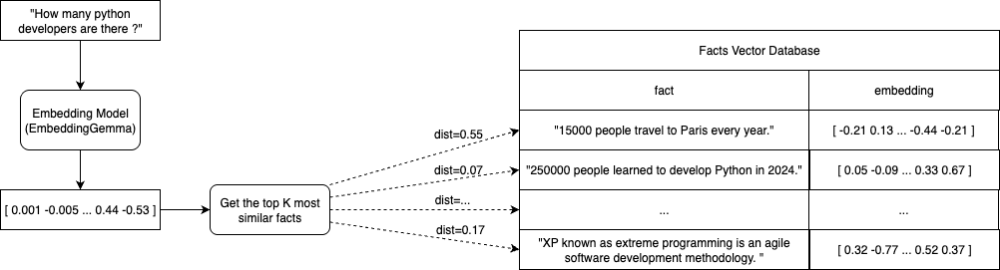

## Sementic Search with Minimal RAG using Ollama

Retrieval Augmented Generation (RAG) allows for Large Language Models (LLMs) search to incorporate knowledge that they were not trained for originally.

Implementing a simple RAG is relativetly simple and the steps could be summarised as follows:

* read a database of extended facts
* convert facts to embedding vectors that compact the meaning of the fact
* convert the query to embedding vector
* get the top N (where N=3 or 5, typically) most similar facts to the provided query using corresponding embeddings
* build an augmented query with a context by appending it with the most similar facts
* build final prompt with pre-instruction and augmented query
* send to LLM and get output


The RAG system demonstrated here can be broken in 2 parts:

* Prepare Vector Database for the Facts
* Worflow to Process RAG Query

```{mermaid}
flowchart LR
    query --> |embedding| top_k_similar[top similar facts]
    facts_db[(facts database)] --> |embeddings| top_k_similar
    top_k_similar --> |augmented query with facts| LLM(LLM)
    LLM --> answer{{answer}}
```


### What and Why using Embeddings ?

The embeddings referred in this article are part of a technique in Natural Language Processing called 
sentence embedding whose idea is to encode a text sentence into a vector that represents 
meaningful semantic information.

```{mermaid}
flowchart LR
    sentence["The book is on the table"] --> embedding_model([sentence embedding model]) --> embedding["[ v1 v2 v3 ... v768]"]
```

Such vectors are more efficient for scalable similarity comparisons that can involve thousands or hundreds of thousands of facts in a database as opposed to compare each character of a query to each character of a fact.

Just like large language models, there are several embedding model available to be chosen, 
in this example, the chosen embedding model is `nomic-embed-text`.


### Part 1 - Prepare Vector Database for the Facts

First the existing knowledge base represented as facts need to be compacted in a vector format to optimise search efficiency.

```{mermaid}
flowchart LR
  facts_file[(my_facts.txt)] --> |text facts| convert_to_embedding_vectors[convert to embedding vectors]
  convert_to_embedding_vectors --> |facts embeddings| vector_database[(vectors database)] 
```


**Read Fact Database**

To keep it simple, for demonstration purposes, the facts will be read from a text file to a text vector:

```python
def read_knowledge_facts(input_text_file: str) -> List:
  dataset = []
  with open(input_text_file, 'r') as file:
    dataset = file.readlines()
    print(f'Loaded {len(dataset)} entries')
  return dataset
```


**Vector Database Format**

A vector database should contain 2 columns (or fields):

* sentence - original text sentence
* embedding - vector sentence representation based on sentence embedding

| sentence                       | embedding                     |
|--------------------------------|-------------------------------|
| Vivamus, Moriendum Est         | `[ a1  a2  a3  a4  a5 ... ]`  |
| Condemnant quo non intellegunt | `[ b1  b2  b3  b4  b5 ... ]`  | 
| Audentes fortuna iuvat         | `[ c1  c2  c3  c4  c5 ... ]`  | 


The data above can be saved in a file or database but for the minimal RAG below it will be stored in a vector in memory.


### Part 2 - Worflow to Process RAG Query

After vector-based database is created, the second part is about the workflow from the user query all the way to get
an answer from chosen Large Language Model.


```{mermaid}
flowchart LR
   vector_database[(vectors database)] --> |facts embeddings| get_top_most_similar[get top most similar]
   get_top_most_similar --> |query augmented with facts| llm_model([large language model])
   llm_model --> get_answer[get answer]
   read_input_query[read input query] --> convert_query_to_embedding_vector[convert query to embedding vector] 
   convert_query_to_embedding_vector --> |query embedding| get_top_most_similar
```


### Developing RAG with Ollama

**Ollama** is a popular tool to run open-source LLM models in a local machine by providing an interface via CLI or python library from where a developer
can pull available models such as `Gemma` or `Qwen` as well as Embedding Models such as `nomic-embed-text`.

In this article, the [ollama](https://pypi.org/project/ollama/) python library will be used to build the RAG semantic searcher.


* **Sentence Embedding** 

**Ollama** supports sentence embedding by selecting an Embedding Model and providing the sentence as text input.

An object is returned from `ollama.embed` that contains the embedding include as part of the object structure.

The whole process is simplified by the function `embed_text_input` below.


```python
import ollama


def embed_text_input(model, input_text):
  return ollama.embed(model=model, input=input_text)['embeddings'][0]
```

Testing ....

```python
EMBEDDING_MODEL = 'nomic-embed-text'
text_sentence = 'The book is on the table'

sentence_embedding = embed_text_input(model=EMBEDDING_MODEL, input_text=text_sentence)

print(f"embedding size = {len(sentence_embedding)}")
print(sentence_embedding)
```

result (vector of 764 items)
```text
embedding size = 768
[0.011797202, 0.06478697, -0.18005921, ...,  -0.0026461834, -0.038637, -0.01212106]
```


* **Converting Sentences to Sentence Embeddings**

Sentences are received as a list of text and should be converted to a structure that serves to keep the original text but also 
contain the corresponding convertion to an embedding sentence.

This way, each text sentence is converted to a tuple where first key is the original text value and the secont the is 
corresponding embedding representation.


```python
from typing import List


def convert_facts_to_embeddings_vector(model, dataset: List[str]) -> List:
  vector_database = []
  for i, chunk in enumerate(dataset):
    embedding = embed_text_input(model=model, input_text=chunk)
    vector_database.append((chunk, embedding))
    print(f'Added chunk {i+1}/{len(dataset)} to the database')
  return vector_database
```


* **Retrieving Facts Related to the Query**

The most relevant facts to the provided query need to be found so this query can be extended with a context that will complement the LLMs knowledge.

To do that, we need a vector distance function (cosine similarity) and a retrieve function that will return the K-most similar fact vectors given a quert vector.





```python
import numpy as np


def cosine_similarity(a, b) -> float:
  return np.dot(a, b) / (np.linalg.norm(a) * np.linalg.norm(b))


def retrieve_top_similar(model, vector_database, query, top_n=3):
  query_embedding = embed_text_input(model=model, input_text=query)
  similarities = []

  for chunk, embedding in vector_database:
    similarity = cosine_similarity(query_embedding, embedding)
    similarities.append((chunk, similarity))

  similarities.sort(key=lambda x: x[1], reverse=True)
  return similarities[:top_n]
```


* **Instantiating an Large Language Model**

When **Ollama** is installed, it creates a local service where the pulled Large Language Models runs.

That LLM service can be accessed via an available `ollama` python library as shows in the code snippet below:

```python
import ollama


stream = ollama.chat(
  model='gemma3',
  messages=[
    { "role": "system", "content": "You are a helpful chatbot specialized in story telling." },
    { "role": "user",   "content": "Tell me a very short story of a boy that wanter to be a bear." },
  ],
  stream=True,
)

print('Chat response:')
for chunk in stream:
  print(chunk['message']['content'], end='', flush=True)
```


### Complete Code Listing

Given the functions defined above, we can organise the code the following way:

```python
from typing import List

import ollama
import numpy as np


def read_knowledge_facts(input_text_file: str) -> List:
  dataset = []
  with open(input_text_file, 'r') as file:
    dataset = file.readlines()
    print(f'Loaded {len(dataset)} entries')
  return dataset


def embed_text_input(model, input_text):
  return ollama.embed(model=model, input=input_text)['embeddings'][0]


def convert_facts_to_embeddings_vector(model, dataset: List[str]) -> List:
  vector_database = []
  for i, chunk in enumerate(dataset):
    embedding = embed_text_input(model=model, input_text=chunk)
    vector_database.append((chunk, embedding))
    print(f'Added chunk {i+1}/{len(dataset)} to the database')
  return vector_database


def cosine_similarity(a, b) -> float:
  return np.dot(a, b) / (np.linalg.norm(a) * np.linalg.norm(b))


def retrieve_top_similar(model, vector_database, query, top_n=3):
  query_embedding = embed_text_input(model=model, input_text=query)
  similarities = []

  for chunk, embedding in vector_database:
    similarity = cosine_similarity(query_embedding, embedding)
    similarities.append((chunk, similarity))

  similarities.sort(key=lambda x: x[1], reverse=True)
  return similarities[:top_n]


EMBEDDING_MODEL = 'nomic-embed-text'
LANGUAGE_MODEL = 'gemma3'
KNOWLEDGE_FILE = 'cat-facts.txt'


print('Pulling necessary models ... ')
ollama.pull(EMBEDDING_MODEL)
ollama.pull(LANGUAGE_MODEL)
print('DONE')

fact_dataset = read_knowledge_facts(KNOWLEDGE_FILE)
VECTOR_DB = convert_facts_to_embeddings_vector(EMBEDDING_MODEL, fact_dataset)

input_query = "How many people are bitten by cats in the U.S. annually ?"
retrieved_knowledge = retrieve_top_similar(EMBEDDING_MODEL, VECTOR_DB, input_query)

instruction_prompt = 'You are a helpful chatbot specialized in cats.\n\nUse only the following context below:\n'
instruction_prompt += '\n'.join([ f' - {chunk}' for chunk, similarity in retrieved_knowledge ])

stream = ollama.chat(
  model=LANGUAGE_MODEL,
  messages=[
    {'role': 'system', 'content': instruction_prompt},
    {'role': 'user',   'content': input_query},
  ],
  stream=True,
)

print('Chat response:')
for chunk in stream:
  print(chunk['message']['content'], end='', flush=True)

```

Result:
```
Pulling necessary models ... 
DONE
Loaded 150 entries
Added chunk 1/150 to the database
Added chunk 2/150 to the database
Added chunk 3/150 to the database
...
Added chunk 149/150 to the database
Added chunk 150/150 to the database
Chat response:
Approximately 40,000 people are bitten by cats in the U.S. annually. 
```


